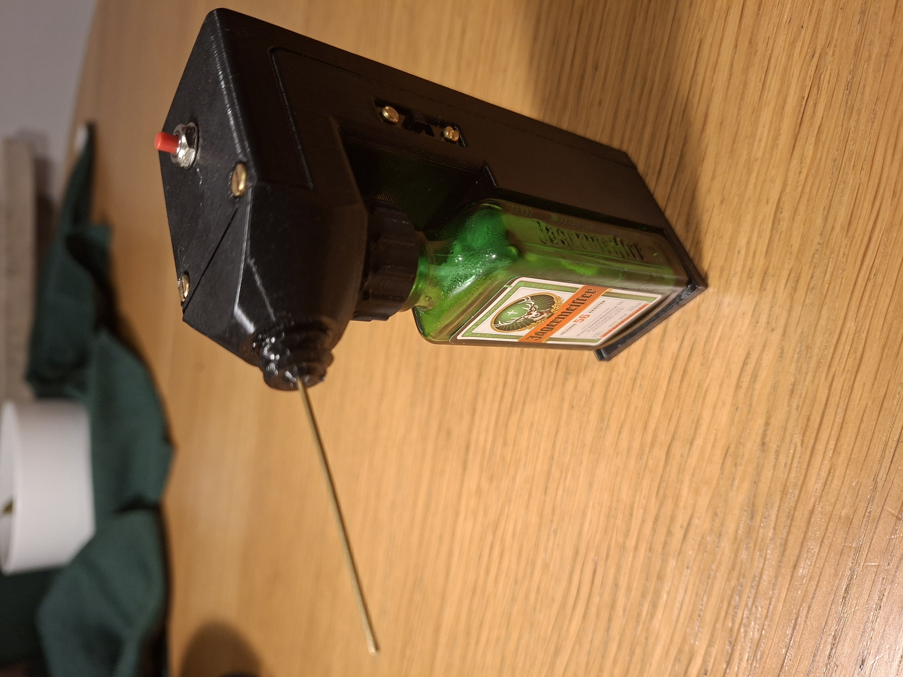

# What is it?

This is an oil dispenser that uses a small peristaltic pump to administer small amounts of oil to lubricate your bicycle chain. It can work for other things too. The idea is to deliver a very small and even amount of thick oil precisely into the gap between the chain links. This way it get sucked into the space between the links leaving the surface of the chain mostly dry. Every push of the button dispenses about 0.005 ml of oil (Can be adjusted).

# Why did you make it?

I was doing the chain clean/lubricate routine on my bicycles and got a bit frustrated by the fact that I could not squeeze an equal and small enough amount of oil onto every chain link every time.

# What? How is this better than an eyedropper/chain lube bottle?

An eyedropper is surely simpler, cheaper and is more reliable, so this gadget is mostly for people who like gadgets :) That said, IMO this device works better for dispensing small and even amounts, at least in my hands. 

# What oil to use.

I found that thicker stuff works best. I use 80w90 gear oil. If you put the right and small amount onto the link connection point it gets sucked in and stays there leaving the chain surface clean. See the video.

# What makes it special?

It uses a Jägermeister bottle as the oil container!

# How to build

See the [build guide](docs/how_to_build.md) for hints and bill of materials.

# Extra
Since most parts are sold in bulks I had enough of them to build a couple extra gadgets which I put on Tindie, in case there is anyone who wants one but doesn't want to build.

https://www.tindie.com/products/mediocregadgets/jag-oiler/