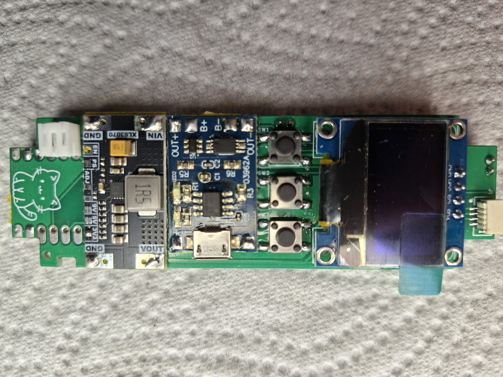
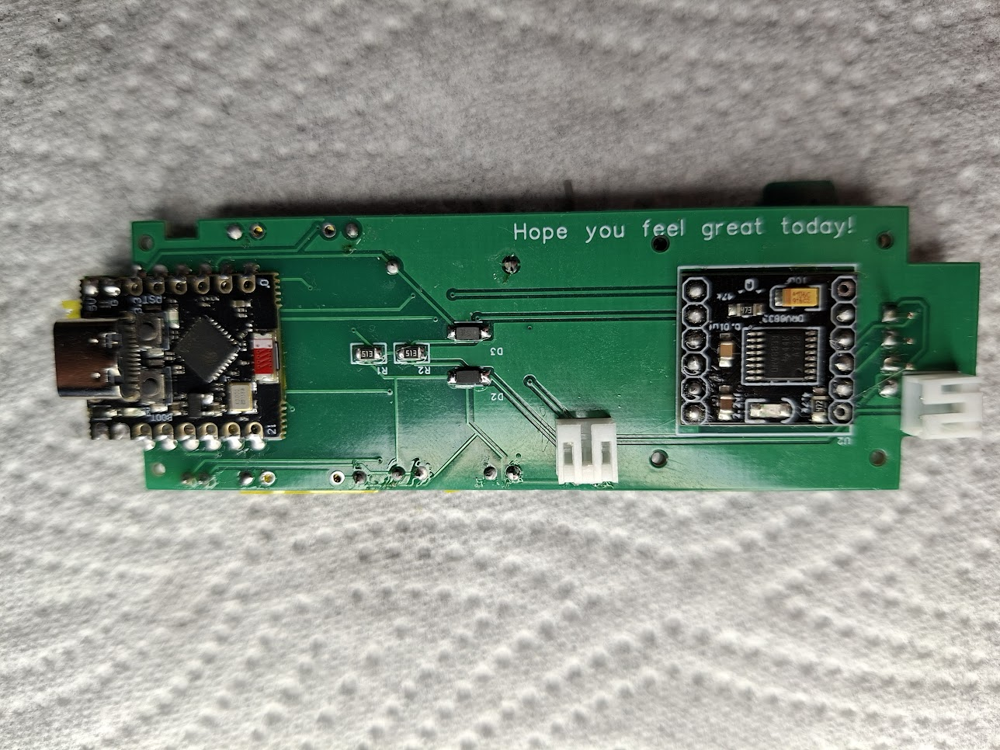

# Build notes

The electronics part is a bunch of readymade modules from AliExpress hand-soldered to a custom PCB.
The only challenging part is probably the pump JST connector at the top with 1 mm spacing between the pins.
I'm not an electronics engineer, keep that in mind if you look at the schematics/PCB files.

The STL files for the case are also in this repo. I used PETG to print it.

# Bill of Materials

| Part | Details/AliExpress Search Term |
|------|-------------------------------|
| ESP32-C3 Mini | |
| Pump | Tiny 8mm water pump stepper motor metering precision peristaltic flow control water liquid pump for medical experiment. |
| XL6309 | |
| TP4056 | |
| DRV8833 | Make sure it is enabled by default. There are 2 pads on the back side that should be shorted. |
| SSD1306 | There are 2 models: "original" and "new". You need the original one. |
| 14500 Li-Ion Battery x2 | |
| Filament | |
| PCB | |
| Diode | 1N5819 SOD-123 |
| Resistor 51kΩ x2 | 0805 51kΩ |
| Power Connector | JST PH 2.0 |
| Pump Connector | JST SH1.0 Connector 2P |
| Inserts 2mm x2 (Power Switch) | M2 (OD 3.5mm) |
| Inserts 3mm x6 (Cover) | M3×5.7 OD 4.6 |
| Bolts 2mm x2 | M2×3 |
| Bolts 3mm x6 | M3×12 |
| Screws x6 | M1.2, 5mm |
| Buttons SMT x3 | Micro 6×6×5mm momentary tactile push button switch 4-pin ON/OFF keys button. |
| Button Top | 5mm spring return momentary micro push button switch 0.5A 125VAC DS-402. |
| Power Switch | 50V 0.3A SS12F15 mini size black SPDT slide switch for DIY power electronic projects G6 1P2T toggle switch, handle 6mm, handle length 2mm. |
| PTFE Tube | ID 1mm, OD 2mm |
| Brass Tube | OD 1.2mm, ID 0.8mm |
| Jägermeister Bottle | 20ml |
